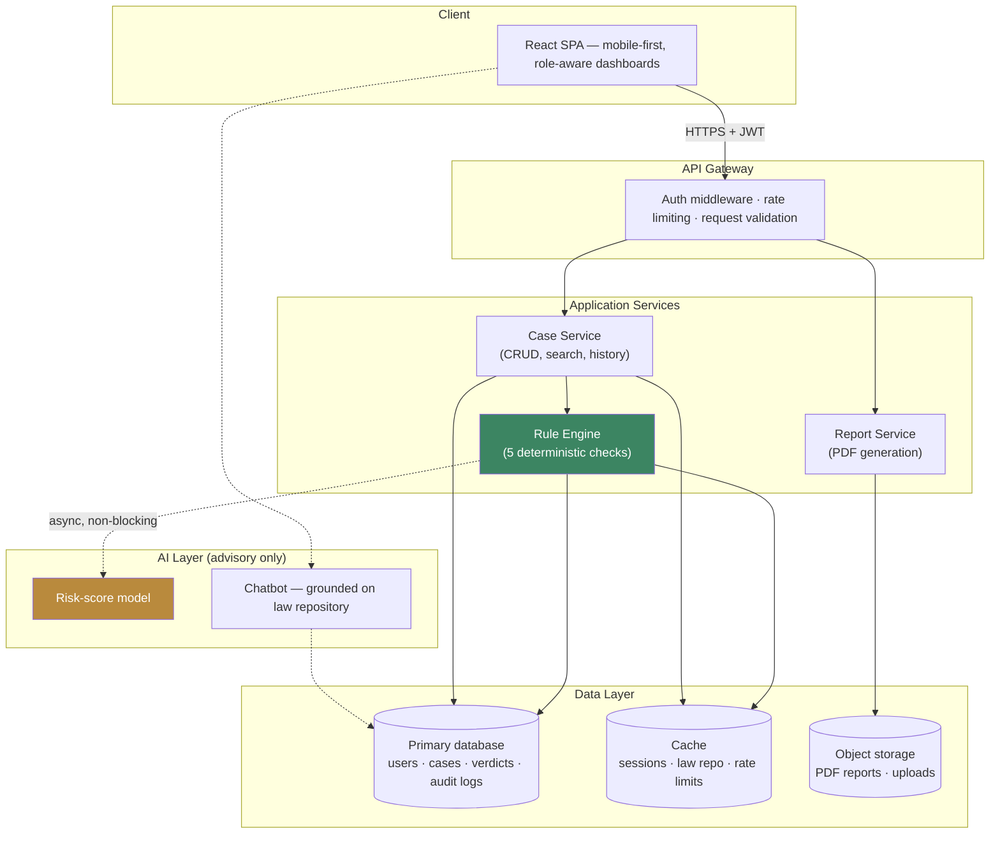
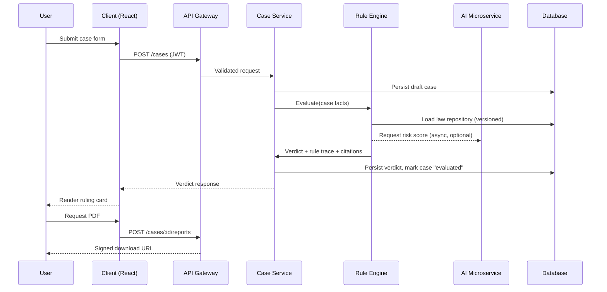

# Bail Reckoner

**A digital decision-support system for bail eligibility assessment**
Built for SIH1702 — Ministry of Law & Justice, Government of India

> Bail Reckoner helps undertrial prisoners, their families, and legal aid lawyers get a fast,
> explainable, law-cited assessment of bail eligibility under Indian criminal law (BNS 2023 /
> BNSS, with IPC/CrPC cross-referencing). It is a decision-support tool, not legal advice, and
> never replaces a judicial decision.

---

## Table of contents

- [Why this exists](#why-this-exists)
- [Core features](#core-features)
- [System architecture](#system-architecture)
- [Eligibility check — data flow](#eligibility-check--data-flow)
- [Rule engine logic](#rule-engine-logic)
- [Tech stack](#tech-stack)
- [Project structure](#project-structure)
- [Getting started](#getting-started)
- [Roles](#roles)
- [Disclaimer](#disclaimer)
- [License](#license)

---

## Why this exists

Over 75% of India's prison population are undertrials who have not been convicted of any
crime. Many are eligible for bail under codified provisions — like the half-term detention
rule (Section 479 BNSS) — but never find out, because no free tool checks eligibility
automatically, and the 2024 transition from IPC/CrPC to BNS/BNSS 2023 has created confusion
even among practicing lawyers.

Bail Reckoner evaluates a case against five codified legal checks and returns a verdict with
a full rule-by-rule citation trail, so a family or a lawyer can understand *why*, not just
*what*.

## Core features

- ⚖️ **Deterministic rule engine** — five ordered legal checks (offence type, time served,
  flight risk, evidence risk, procedural readiness), fully auditable, no black-box logic.
- 🔁 **IPC ↔ BNS 2023 section mapping** — a versioned crosswalk so every verdict cites current
  law, with the legacy section shown alongside for transparency.
- 📄 **Citation-backed PDF reports** — plain-language explanation plus the legal basis for
  every claim.
- 👥 **Role-based workflows** — separate dashboards for individuals/families, lawyers & NGOs,
  and admins.
- 🌐 **Multilingual UI** — Hindi and English first, regional languages phased in.
- 🤖 **Advisory ML risk score** *(optional layer)* — never overrides the deterministic verdict.
- 🔒 **Auditable by design** — every state-changing action is logged; the rule engine and law
  repository are both versioned.

## System architecture



**The one architectural decision that matters most:** the rule engine is a deterministic,
pure-function pipeline, kept fully separate from the advisory ML layer. The ML risk score can
fail, time out, or be disabled entirely without ever blocking a verdict — a legal-eligibility
tool has to stay explainable and auditable above all else.

## Eligibility check — data flow



## Rule engine logic

Five checks run in a fixed priority order; a hard-stop rule short-circuits later checks where
the law is dispositive on its own.

1. **Offence type** — bailable offences are eligible as a matter of right; non-bailable
   continues to the next check.
2. **Time served** — Section 479 BNSS / 436A CrPC: first-time offenders at 1/3 of max
   sentence, others at 1/2, can independently establish eligibility.
3. **Flight risk** — weighted, admin-configurable rubric (residence stability, employment,
   dependents, prior appearance/absconding record).
4. **Evidence risk** — witness-tampering flags, co-accused status; high risk can block
   eligibility outright, medium risk converts a clean "eligible" into "eligible with
   conditions."
5. **Procedural check** — surety/bond/ID readiness; doesn't change the verdict, flags whether
   the case is ready to file.

Every rule's output carries its citation, so the verdict is never a bare "yes/no" — it's a
traceable legal argument.

## Tech stack

> Update this table to match your actual implementation — the SRS reference stack is listed
> here as a starting point.

| Layer | Technology |
|---|---|
| Frontend | React + TypeScript, Tailwind CSS |
| Backend API | _fill in_ |
| Database | _fill in_ |
| Cache | _fill in_ |
| Auth | JWT + OTP (phone-first) |
| PDF generation | _fill in_ |
| AI/ML microservice | _fill in_ |
| Deployment | _fill in_ |

## Project structure

```
bail-reckoner/
├── frontend/          # React app — role-aware dashboards, case form, verdict UI
├── backend/           # API — auth, case service, rule engine, report service
├── ai-service/        # Advisory risk-score model + chatbot (optional layer)
├── docs/              # SRS, ERD, API contracts
└── README.md
```

## Getting started

```bash
# clone
git clone https://github.com/<your-org>/bail-reckoner.git
cd bail-reckoner

# backend
cd backend
npm install
cp .env.example .env   # fill in DB/cache/JWT secrets
npm run dev

# frontend
cd ../frontend
npm install
npm run dev
```

## Roles

| Role | What they can do |
|---|---|
| Prisoner / Family Member | Create own case, run eligibility check, download PDF, chat support |
| Lawyer / Legal Aid Volunteer | Manage multiple client cases, bulk pre-screen, export reports |
| Administrator | Manage law repository, review audit logs, configure rule weights |
| Super Admin | All admin rights + RBAC config, feature flags, deployment settings |

## Disclaimer

> Bail Reckoner provides an automated, informational assessment based on codified Indian law
> (IPC/BNS 2023, CrPC/BNSS) and the facts provided. It is not legal advice, does not
> constitute a court order, and does not guarantee any outcome. Bail is ultimately determined
> by a court. Please consult a lawyer or your nearest Legal Services Authority for
> representation.

## License

_Add your license here (MIT is common for academic/portfolio projects)._
